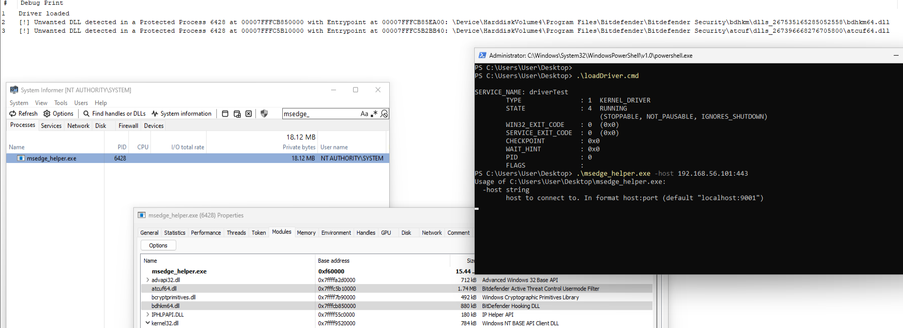

# ABDDriver
Windows Kernel Driver registering callbacks for process creation and image loading. Blocks blacklisted Dlls from loading into specified protected process

## Notes

* For now only filters processes and loaded images and finds the entry point of blacklisted DLLs.

### TODO
* fix BSOD on write from kernel to user mod address space

## Details 
* Tested on Windows 11 22H2 (OS Build 22621.4602)
* BitDefender Antivirus Free | Build 27.0.46.231

