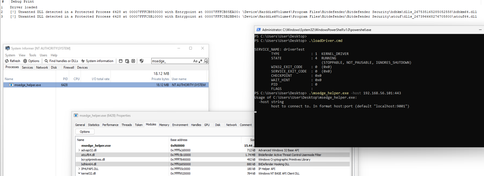
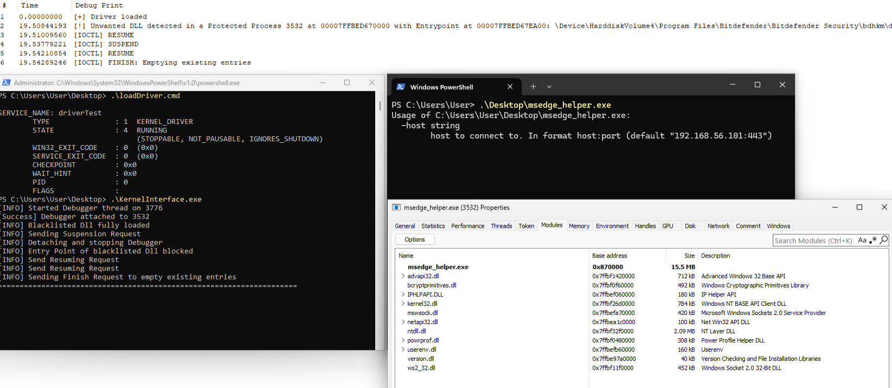

# ABDDriver
Windows Kernel Driver and Usermode Interface for registering callbacks for process creation and image loading. Blocks blacklisted Dlls from loading into specified protected process.

## How It Works

* Load KD and run UMI in a SYSTEM shell.
* KD detects the protected process creation , and the blacklisted Dll mapping. On that , protected process is suspended using `PsSuspendProcess`
* Needed Data like process handle , module handle , address of entry point are communicated to UMI, which attaches a debugger to the protected process and waits for `LOAD_DLL_DEBUG_EVENT` on the blacklisted Dll , sends RESUME IOCTL to resume execution and hit debug event.
* On `LOAD_DLL_DEBUG_EVENT` , i.e Dll is fully loaded and its imports/exports are resolved , SUSPEND IOCTL is sent to stop Dll from reaching the Entry Point.
* Entry Point is overwritten (**from user mode , for now**) with `XOR EAX, EAX; RET` , to block any further execution.
* Final RESUME IOCTL is sent to resume Protected Process , successfully avoiding any blacklisted Dlls to be loaded. 

### TODO
* Overwrite Dll Entry Point directly from Kernel mode , instead of user mode.

## Details 
* Tested on Windows 11 22H2 (OS Build 22621.4602)
* BitDefender Antivirus Free | Build 27.0.46.231

## Screenshots
* Just logging the blacklisted Dlls

* Logging and Blocking the blacklisted Dlls

